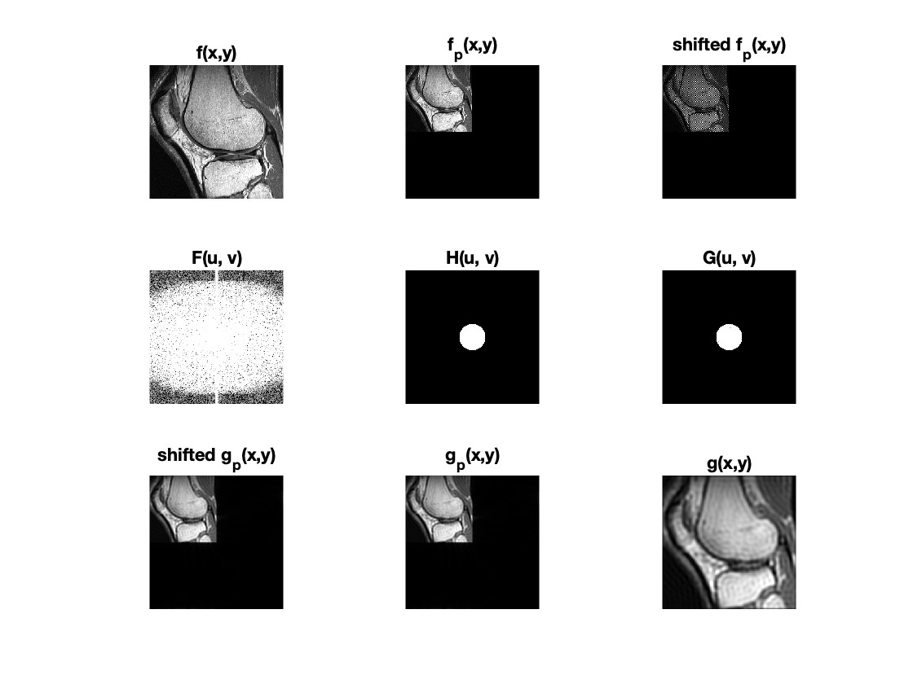

# Project 3: 2D DFT in Image Filtering
CS/EE-712: Image Processing Spring 2024  
Student: Shyang-En Weng  
Programming Language: MATLAB,

## Code explaination
1. Read the input image f(x,y) specified by img_path.
2. Define the D0 (cutoff frequency)
3. Padding: f_p(x,y)
```
// [MM, NN] = size of the f(x,y)
// [M, N] := size of the f_p(x,y)
M = 2 * MM -1;
N = 2 * NN -1;
```
4. Shift: shifted f_p(x,y)
```
shifted f_p(x,y) = f_p(x,y) * (-1)^(x+y)
```
5. DFT of shifted f_p(x,y)
```
F(u, v) = DFT(f(x,y)) = DFT_row( DFT_col( shifted f_p(x,y)))
```
6. Filter the F(u, v) by Low-pass Filter H(u, v)
```
G(u, v) = H(u, v) F(u, v)
```
7. IDFT of G(u, v)
```
shifted g_p(x,y) = IDFT_row( IDFT_col(G(u, v)))
```
8. Shift it back
```
g_p(x,y) = shifted g_p(x,y) * (-1)^(x+y)
```
9. Crop: crop the top-left corner of g_p(x, y)
```
g_p(x, y) = g_p(1:MM, 1:NN)
```
10. Save image



## Usage
### MATLAB Code
```
// modifiy the img_path & D0 before execute
DFTfilter.m
```

## Attachments
1. readme.md (readme file)
2. DFTfilter.m (MATLAB code)
3. LPF_50.pgm & LPF_10.pgm (output files with D0 = 50 & 10)